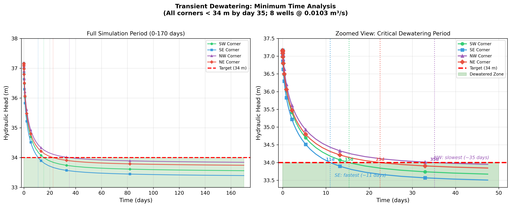

# Project Report: Groundwater Modelling

**Group members:** Liuhuang Luo, Sophie Edimo  
**Program:** Sustainable Land Management (SULAMA)  
**Submission Date:** 28/11/2025

---

## Table of Contents

1. [Introduction](#1-introduction)
2. [Conceptual Model](#2-conceptual-model)
3. [Mathematical Model](#3-mathematical-model)
4. [Numerical Model](#4-numerical-model)
5. [Calibration](#5-calibration)
6. [Sensitivity Analysis](#6-sensitivity-analysis)
7. [Results and Predictions](#7-results-and-predictions)
8. [Conclusions and Recommendations](#8-conclusions-and-recommendations)
9. [References](#9-references)
10. [Annexes](#annexes)

---

## 1. Introduction

Groundwater plays a key role in the hydrogeological functioning of alluvial plains, particularly in areas where rivers, unconsolidated sediments, and underlying sedimentary formations interact to form complex flow systems. The study area considered in this project represents such an environment: an alluvial aquifer composed of heterogeneous gravel and sand deposits overlies a less permeable sedimentary aquitard and an impermeable bedrock. Groundwater levels in this system are influenced by natural recharge, regional hydraulic gradients, and interaction with a south‑to‑north flowing river located along the eastern boundary of the domain.

In the context of planned construction activities, an excavation pit must be dewatered and maintained in dry conditions for an extended period. Understanding the hydraulic behavior of the aquifer system—both under natural conditions and when subjected to pumping—requires the development of a calibrated numerical model capable of simulating groundwater flow and advective transport. As a SULAMA student, the focus of the project lies on flow modelling and particle‑tracking analysis rather than full solute transport simulation.

The objectives of this study are therefore to:

1. **Develop a conceptual model** describing the hydrogeological setting, geological structure, boundary conditions, and key physical assumptions.
2. **Construct and calibrate a steady-state MODFLOW 6 groundwater flow model** using observed hydraulic head data under natural and pumping conditions.
3. **Calibrate a transient model** to estimate aquifer storage parameters using pumping test drawdown measurements.
4. **Determine the minimum pumping rate** required to keep the excavation pit dry under steady‑state conditions.
5. **Estimate the minimum time required to dewater the pit** using transient simulations.
6. **Sensitivity analysis**, whether a continuous contaminant leakage located 300 m east of the pit could potentially reach the excavation during the 4‑month construction period.

A wide range of data is available to support the modelling process, including borehole stratigraphy, piezometric measurements under natural and pumped conditions, pumping test drawdown curves, and spatial information on recharge and river stages. These datasets are summarized throughout the report, with full details provided in the annex.

---

## 2. Conceptual Model

### 2.1 Geological and Hydrogeological Setting

The study area consists of an alluvial aquifer system underlain by sedimentary rock units and a low-permeability bedrock. The upper aquifer (Layer 1) is composed of four lithological types: **clean gravel**, **clayey sand**, **loamy sand**, and **sandy gravel**. These units collectively form an unconfined aquifer with spatially variable hydraulic conductivity.

The underlying layer (Layer 2) represents an aquitard composed of **sandstone** and **limestone**, both exhibiting significantly lower permeability than the overlying alluvial deposits. Beneath these two layers lies the regional **bedrock**, which is treated as an impermeable no-flow boundary. The overall topography gently slopes from west to east, influencing regional groundwater flow toward the river on the eastern boundary.

**Image 2.1: Base map**

.png)

### 2.2 Model Extent and Boundaries

The model domain extends from the western hillslope to the eastern river, capturing the full lateral flow system. Although the western boundary represents a hill, only the *lowest slope line* is used to apply **slope recharge**, representing lateral inflow from hill runoff or subsurface flow.

The **eastern boundary** is defined by a river flowing from south to north, which acts as a head-dependent boundary and represents the primary groundwater discharge zone.

The **northern and southern boundaries** are assigned as **General Head Boundaries (GHB)** to allow natural inflow and outflow without imposing a fixed head. This avoids artificial boundary effects and maintains regional groundwater gradients.

Recharge is applied across the entire top surface of the model to represent **precipitation infiltration** under natural conditions.

### 2.3 Layer Structure and Geometry

The model contains two hydrogeological layers above an impermeable bedrock:

- **Layer 1 – Alluvial Aquifer**: composed of clean gravel, clayey sand, loamy sand, and sandy gravel. This layer is unconfined and exhibits significant heterogeneity in hydraulic conductivity.
- **Layer 2 – Sedimentary Aquitard**: composed of sandstone and limestone. These units have lower hydraulic conductivity and restrict downward flow.

Below Layer 2, the **bedrock** forms a no-flow boundary. The surface elevation decreases slightly from west to east, consistent with regional topography. The thickness of the alluvial deposits varies spatially based on borehole data and is interpolated throughout the model domain.

**Image 2.2: Lithology KX Distribution**


### 2.4 Assumptions and Simplifications

The following assumptions and simplifications were applied to ensure a tractable and numerically stable groundwater flow model.

**Hydraulic anisotropy** was incorporated by assuming vertical hydraulic conductivity to be lower than horizontal conductivity, following the common hydrogeological approximation $K_z = \frac{1}{10} K_x$, which reflects reduced vertical flow due to sediment layering and compaction. **Layer 1 (alluvial deposits)** is modeled as an unconfined aquifer consistent with its high permeability and direct contact with the ground surface, implemented in MODFLOW using Cell Type = 1, while **Layer 2 (sandstone and limestone)** is modeled as a confined aquitard where storage is dominated by elastic compression, using Cell Type = 0.

Regarding **boundary conditions**, the western hillslope is represented only by its lowest contour line where slope recharge is applied instead of explicitly modeling the entire hill; the northern and southern limits are treated as General Head Boundaries (GHB) to permit natural flow exchange while preventing artificial head buildup; and the eastern river boundary is considered a fully penetrating head-dependent boundary. A **uniform areal recharge** is applied to the model top to represent precipitation infiltration, assuming no spatial variability in rainfall or soil infiltration capacity. The **model top elevation** is set to a constant 40 m across the entire domain, assuming flat terrain—this simplification is appropriate because the focus of the study is on aquifer hydraulics rather than surface topography, and observed head variations are relatively small compared to the aquifer thickness. Each **lithology type** is assumed internally homogeneous, with spatial heterogeneity represented only through zonation rather than continuous property fields.

These assumptions are necessary to simplify the model while retaining the essential hydrogeological behavior of the system. Importantly, the conceptual model describes the *real-world hydrogeological system*, while the practical implementation of these assumptions (e.g., cell types, packages, numerical settings) is carried out later in the **Numerical Model** section using specific MODFLOW 6 configurations.

---

## 3. Mathematical Model

### 3.1 Governing Equations

The groundwater flow model is based on the three-dimensional mass conservation equation for saturated porous media. Under the assumption of constant fluid density and negligible fluid compressibility relative to aquifer compressibility, the governing equation is:

#### 3.1.1 Steady-State Flow Equation

For steady-state conditions (natural and pumping scenarios without storage effects), the groundwater flow equation simplifies to:

$$
\frac{\partial}{\partial x}\left(K_x \frac{\partial h}{\partial x}\right) + \frac{\partial}{\partial y}\left(K_y \frac{\partial h}{\partial y}\right) + \frac{\partial}{\partial z}\left(K_z \frac{\partial h}{\partial z}\right) = Q
$$

In this equation, $h$ represents hydraulic head (m), $K_x$, $K_y$, $K_z$ are the hydraulic conductivity components in the x, y, and z directions (m/s), and $Q$ is the volumetric flux per unit volume representing sources and sinks (1/s). The steady-state formulation assumes no temporal variation ($\partial h/\partial t = 0$), time-invariant aquifer properties, and that the system has reached equilibrium between inflows and outflows.

#### 3.1.2 Transient Flow Equation

For time-dependent simulations (pumping test calibration and dewatering scenarios), the full transient equation is used:

$$
\frac{\partial}{\partial x}\left(K_x \frac{\partial h}{\partial x}\right) + \frac{\partial}{\partial y}\left(K_y \frac{\partial h}{\partial y}\right) + \frac{\partial}{\partial z}\left(K_z \frac{\partial h}{\partial z}\right) = S_s \frac{\partial h}{\partial t} + Q
$$

For **unconfined aquifers** (Layer 1), the storage term is modified to account for water table variation:

$$
S_s \frac{\partial h}{\partial t} \rightarrow S_y \frac{\partial h}{\partial t}
$$

Here, $S_s$ is the specific storage (1/m) representing elastic storage in confined aquifers, $S_y$ is the specific yield (dimensionless) representing drainable porosity in unconfined aquifers, and $t$ is time (s). For confined aquifers (Layer 2), storage arises from elastic compression of the aquifer matrix and expansion of water, where changes in head do not affect saturated thickness. For unconfined aquifers (Layer 1), storage is dominated by gravity drainage of pore water, and changes in head correspond directly to water table rise or fall.

#### 3.1.3 Anisotropy

Horizontal anisotropy is assumed negligible ($K_x = K_y = K_h$), but **vertical anisotropy** is significant due to sediment layering:

$$
K_z = \frac{K_h}{10}
$$

This 10:1 ratio reflects preferential horizontal flow pathways in stratified alluvial deposits.

### 3.2 Parameters and Physical Meaning

#### 3.2.1 Hydraulic Conductivity ($K$)

Hydraulic conductivity (m/s) represents the ability of a porous medium to transmit water under a hydraulic gradient. High K values (e.g., clean gravel) correspond to rapid groundwater flow and quick response to pumping, while low K values (e.g., clayey sand) indicate slow flow, delayed response, and partial barrier behavior. The governing relationship is Darcy's Law: $q = -K \nabla h$, where $q$ is specific discharge (m/s) and $\nabla h$ is hydraulic gradient. In the model, K is spatially heterogeneous, assigned by lithological zones, and calibrated to match observed hydraulic heads under natural and pumped conditions.

#### 3.2.2 Specific Yield ($S_y$)

Specific yield (dimensionless, typically 0.01–0.35) is defined as the volume of water released from storage per unit surface area per unit decline in water table, applicable only to unconfined aquifers. It represents effective porosity—the fraction of pore space that yields water by gravity drainage. Higher Sy values mean more water is released per meter of drawdown, resulting in slower water table decline. In transient simulations, Sy controls the rate of water table response to pumping or recharge and is a key parameter for estimating dewatering time.

#### 3.2.3 Specific Storage ($S_s$)

Specific storage (1/m, typically 10⁻⁶ to 10⁻⁴) is defined as the volume of water released from storage per unit volume of aquifer per unit decline in hydraulic head, applicable to confined aquifers. It represents elastic storage arising from the compressibility of the aquifer matrix ($\alpha$, 1/Pa) and the compressibility of water ($\beta$, 1/Pa), governed by the relationship $S_s = \rho g (\alpha + n\beta)$, where $\rho$ is water density, $g$ is gravitational acceleration, and $n$ is porosity. Because Ss is much smaller than Sy, confined aquifers respond faster to stress. In the model, Ss affects pressure propagation in Layer 2 (aquitard).

---

## 4. Numerical Model

### 4.1 Software

- **MODFLOW 6 (v6.6.2)** for groundwater flow simulations, implementing the conceptual hydrogeological system through numerical discretization.
- **ModelMuse (v5.4.0.0)** as the graphical interface for model construction, parameter assignment, package configuration, and visualization.
- **Python 3.12** with the following packages for automated calibration and sensitivity analysis:
  - **FloPy**: Python interface for reading, writing, and running MODFLOW models
  - **NumPy** and **Pandas**: Data manipulation and analysis
  - **SciPy**: Optimization algorithms (Latin Hypercube Sampling, differential evolution)
  - **Matplotlib** and **Seaborn**: Visualization of calibration results
  - **Fiona** and **Shapely**: Processing lithology shapefiles for spatial parameter assignment

### 4.2 Grid Design

The model domain was discretized using a structured grid covering an area of **1000 m × 1000 m**. Although MODFLOW 6 is fundamentally a finite-volume program, for structured grids the resulting equations are mathematically equivalent to the classical finite-difference formulation. The base grid resolution was set to **10 m × 10 m**, providing a balance between computational efficiency and the need to accurately represent regional groundwater gradients.

To improve numerical accuracy in zones with strong hydraulic gradients, **local grid refinement** was applied around the pumping well (P1). In this area, the cell size was reduced to **2 m × 2 m**, ensuring a more precise representation of well‑induced drawdown and enabling stable transient calibration. Grid refinement was implemented smoothly to avoid abrupt changes in cell size, which could result in numerical instability.

### 4.3 Boundary and Stress Packages

The conceptual boundary conditions were translated into MODFLOW 6 using a combination of stress packages that reflect regional flow dynamics, recharge processes, and river–aquifer interaction.

#### River Boundary (RIV Package)

A head‑dependent river boundary was applied along the eastern model edge to represent the south–north flowing river. The longitudinal river gradient was implemented using coordinate‑dependent formulas: river stage $h_{river} = 38 - 0.002 \times y$ (m), reflecting measured water levels of 38 m at the southern end and 32 m approximately 3 km north; river bottom elevation $z_{bottom} = 37 - 0.002 \times y$ (m), with river depth of approximately 1 m. The riverbed conductance was initially estimated based on reported hydraulic properties but later treated as a calibration parameter ranging from 8×10⁻⁵ to 2.5×10⁻⁴ m²/s, refined during steady-state calibration to match observed heads.

#### Recharge (RCH Package)

Two types of recharge were applied to represent natural water input into the aquifer system. **Surface recharge (precipitation infiltration)** was applied uniformly across the entire top surface of the model domain, based on the estimated annual infiltration range of 125–210 mm/year; the average value (167.5 mm/year ≈ 5.3×10⁻⁹ m/s) was used as the baseline recharge rate, applied only to Layer 1 (unconfined alluvial aquifer) using the RCH package. **Slope recharge (lateral inflow from western hill)** represents subsurface lateral flow and hillslope runoff from the western boundary, applied along the lowest contour line of the western hillslope at the same estimated infiltration rate (5.3×10⁻⁹ m/s), implemented as additional recharge cells along the western model boundary. The combined recharge system ensures that both areal infiltration and lateral inflow from the topographic high are represented, providing a more complete water balance for the alluvial aquifer.

#### General Head Boundaries (GHB Package)

The northern and southern boundaries were implemented as General Head Boundaries (GHB) to allow natural groundwater exchange without imposing fixed heads, avoiding artificial boundary effects while maintaining realistic regional flow patterns. Conductance values were assigned based on the dominant lithology in each boundary zone: the north boundary uses sandy gravel (Layer 1 background) and limestone (Layer 2 background), while the south boundary uses sandy gravel (Layer 1) and sandstone (dominant Layer 2 lithology in the south). Boundary head values were treated as calibration parameters—north boundary head ranging 37.0–37.2 m and south boundary head ranging 37.5–38.0 m—refined during calibration to match observed hydraulic gradients.

#### Observation Points (OBS Package)

The Observation (OBS) package was activated to extract simulated hydraulic heads at 12 piezometer locations (P1, Pz2–Pz12) distributed across the model domain. This package outputs simulated head values in structured CSV format, containing time-series data for both natural and pumping conditions, eliminating the need to manually post-process binary output files.

#### Wells (WEL Package)

Two types of wells were included in the model. The calibration well (P1), located at the same position as observation point P1 with a screen elevation of 32 m, pumped at 100 m³/h during steady-state calibration to evaluate model performance under stressed conditions. Eight excavation dewatering wells were arranged around the pit perimeter with 2 wells per side positioned at 1/4 and 3/4 of each side length, following common Belgian engineering practice for construction dewatering; screen elevations were set to 32 m (2 m below the pit bottom of 34 m) to ensure effective drawdown, with pumping rates varied iteratively to determine the minimum rate required for dewatering. These boundary and stress packages collectively reproduce the hydrological behavior described in the conceptual model, with critical parameters (river conductance, GHB heads, initial head) subject to calibration refinement.

### 4.4 Layer Properties and Cell Types

- **Layer 1 (Alluvial Aquifer):** implemented as *unconfined* using **Cell Type = 1**, allowing water-table variation and specific yield storage.
- **Layer 2 (Sedimentary Aquitard):** implemented as *confined* using **Cell Type = 0**, where storage is governed by specific storage only.
- Vertical anisotropy was implemented as **Kz = Kx / 10**, consistent with conceptual model assumptions.

These numerical implementations directly translate the conceptual assumptions into MODFLOW 6 computational structures.

---

## 5. Calibration

### 5.1 Steady-State Calibration

The steady-state calibration process aimed to determine optimal hydraulic conductivity values for six lithological units and refine boundary condition parameters to match observed hydraulic heads under both **natural** (no pumping) and **pumping** (P1 at 100 m³/h) conditions.

#### 5.1.1 Calibration Methodology

A total of **10 parameters** were calibrated using **Latin Hypercube Sampling (LHS) with log-transformed sampling** for hydraulic conductivity values, combined with manual refinement. Log-transformation ensures better coverage of the typical multi-order-of-magnitude K ranges.

Calibration combined **automated Python-based sampling** with **manual GUI refinement**. Phase 1 used a Python script for automated LHS sampling with log-transformation, lithology assignment via FloPy GridIntersect, MODFLOW execution, and RMSE/R² evaluation. Phase 2 involved manual adjustment in ModelMuse to correct cell assignment discrepancies between Python and GUI implementations.

#### 5.1.2 Calibration Results

The calibrated K values fall within typical literature ranges for alluvial and sedimentary materials. Background lithologies (sandy gravel, limestone) show higher sensitivity because they control permeability across the majority of the model domain. The shapefile-defined zones (clean gravel, clayey sand, loamy sand, sandstone) have lower sensitivity due to their limited spatial extent. GHB boundary heads are tightly constrained and should not be modified without careful recalibration.

**Table 5.1: Steady-State Calibration Parameters and Results**

| Category | Parameter | Symbol | Layer | Initial Range | Calibrated Value | Units |
|----------|-----------|--------|-------|---------------|------------------|-------|
| **Background K** | Sandy Gravel | $K_{sg}$ | 1 | 1×10⁻³ – 3×10⁻³ | 9.0×10⁻⁴ | m/s |
| | Limestone | $K_{ls}$ | 2 | 1×10⁻⁴ – 1×10⁻³ | 3.0×10⁻⁵ | m/s |
| **Shapefile Zones** | Clean Gravel | $K_{cg}$ | 1 | 5×10⁻² – 3.5×10⁻¹ | 6.0×10⁻² | m/s |
| | Clayey Sand | $K_{cs}$ | 1 | 1×10⁻⁵ – 5×10⁻⁴ | 1.37×10⁻⁵ | m/s |
| | Loamy Sand | $K_{lms}$ | 1 | 1×10⁻⁵ – 1×10⁻³ | 1.5×10⁻⁵ | m/s |
| | Sandstone | $K_{ss}$ | 2 | 1×10⁻⁵ – 1×10⁻⁴ | 4.11×10⁻⁵ | m/s |
| **Boundary** | River Conductance | $C_{riv}$ | – | 8×10⁻⁵ – 2.5×10⁻⁴ | 2.5×10⁻⁴ | m²/s |
| | North GHB Head | $h_{N}$ | – | 37.1 – 37.2 | 37.2 | m |
| | South GHB Head | $h_{S}$ | – | 37.5 – 38.0 | 37.6 | m |
| **Initial** | Initial Head | $h_0$ | All | 37 – 39 | 37.4 | m |

**Table 5.2: Steady-State Calibration Performance**

| Condition | Obs. Points | RMSE (m) | R² |
|-----------|-------------|----------|-----|
| Natural (no pumping) | 12 | 0.030 | 0.946 |
| Pumping (P1 = 100 m³/h) | 12 | 0.212 | 0.842 |

**Image 5.1: Steady state Hydraulic head, Natural (left) and Pumping (right)**


**Figure 5.2: Steady-State Calibration Results (Observed vs. Simulated Heads)**


#### 5.1.3 FloPy vs. ModelMuse Grid Assignment Comparison

During calibration, two methods were compared for obtaining lithology distribution from ModMuse GUI:

The **Shapefile method** (using exported KX.shp with FloPy GridIntersect) showed 429 cells difference in Layer 1 (~2.6%) and 261 cells in Layer 2 (~1.6%) compared to GUI. The **.gpt parsing method** (extracting ScreenObject polygons directly from project file) showed larger discrepancies: 886 cells in Layer 1 (~5.4%) and 602 cells in Layer 2 (~3.7%). Although the .gpt file is the original data source, the Shapefile method better reproduces GUI results because: (1) ModMuse GUI may use cell-center point determination rather than FloPy's area intersection algorithm for boundary cells; (2) the exported Shapefile already contains GUI's internal cell-mapping results. Based on this analysis, the Shapefile method was adopted for Python-based calibration, achieving final performance of RMSE = 0.030 m and R² = 0.946 under natural conditions.

**Figure 5.3: Comparison of FloPy and ModelMuse Model Results**


### 5.2 Transient Calibration

The transient calibration aims to determine storage parameters (Specific Yield $S_y$ for Layer 1 and Specific Storage $S_s$ for Layer 2) using observed drawdown data from the pumping test at well P1. The test was conducted at 100 m³/h (0.0278 m³/s) for 5 days, with drawdown monitored at P1 (pumping well) and Pz12 (approximately 50 m from P1, Layer 2). Hydraulic conductivity values were fixed at steady-state calibrated values, while 12 storage parameters (6 Sy + 6 Ss) were calibrated using Python-based LHS automation with log-transformation for Ss values, followed by manual GUI refinement.

#### 5.2.1 Calibration Results

**Figure 5.4: Transient state Hydraulic head, 0 second (left) and 432000 seconds (right)**


**Figure 5.5: Transient Calibration Results (Observed vs. Simulated Drawdown)**


**Table 5.3: Transient Calibration Parameters and Results**

| Lithology | Layer | Sy Range | Ss Range (1/m) | Calibrated Sy | Calibrated Ss (1/m) |
|-----------|-------|----------|----------------|---------------|---------------------|
| Clean Gravel | 1 | 0.20 – 0.35 | 1×10⁻⁵ – 1×10⁻⁴ | 0.30 | 3.37×10⁻⁵ |
| Clayey Sand | 1 | 0.10 – 0.25 | 1×10⁻⁵ – 1×10⁻⁴ | 0.15 | 5.37×10⁻³ |
| Loamy Sand | 1 | 0.15 – 0.30 | 1×10⁻⁵ – 1×10⁻⁴ | 0.19 | 9.7×10⁻³ |
| Sandy Gravel | 1 | 0.15 – 0.35 | 1×10⁻⁵ – 1×10⁻⁴ | 0.22 | 2.66×10⁻⁵ |
| Sandstone | 2 | 0.001 | 1×10⁻⁶ – 1×10⁻⁴ | 0.001 | 8.58×10⁻⁴ |
| Limestone | 2 | 0.001 | 1×10⁻⁶ – 1×10⁻⁴ | 0.001 | 9.89×10⁻³ |

**Table 5.4: Transient Calibration Performance**

| Observation Point | RMSE (m) | R² | Peak Drawdown Obs. (m) | Peak Drawdown Sim. (m) |
|-------------------|----------|-----|------------------------|------------------------|
| P1 (pumping well) | 0.12 | 0.78 | 1.68 | 1.72 |
| Pz12 | 0.16 | 0.74 | 0.56 | 0.52 |

The transient model captures the temporal evolution of drawdown at both observation points. P1 shows maximum observed drawdown of 1.68 m after 5 days of pumping, while Pz12 reaches 0.56 m. The delayed response at Pz12 reflects aquifer diffusivity and validates the calibrated storage parameters. Early-time behavior (first hour) matches well, indicating appropriate Ss values; late-time behavior confirms Sy calibration for the unconfined layer.

---

## 6. Sensitivity Analysis

### 6.1 Methodology

A **One-at-a-Time (OAT)** sensitivity analysis was performed to identify the most influential parameters on model outputs. Each parameter was perturbed by **±10%** and **±20%** from its calibrated value while keeping all other parameters constant.

**Sensitivity Coefficient:**

$$
S = \frac{\Delta Output / Output_{base}}{\Delta Parameter / Parameter_{base}}
$$

where |S| > 0.1 indicates high sensitivity, 0.01–0.1 indicates moderate sensitivity, and |S| < 0.01 indicates low sensitivity.

### 6.2 Steady-State Sensitivity Analysis

#### 6.2.1 Parameters Analyzed

Ten calibrated parameters were analyzed:
- **Hydraulic conductivity (6):** K for clean gravel, clayey sand, loamy sand, sandstone, sandy gravel, limestone
- **Boundary conditions (4):** River conductance, initial head, GHB north head, GHB south head

#### 6.2.2 Results

**Table 6.1: Steady-State Parameter Sensitivity Ranking**

| Parameter | \|S\| RMSE Nat | \|S\| R² Nat | \|S\| RMSE Pump | \|S\| R² Pump | Avg \|S\| | Rank |
|:----------|:-------------:|:------------:|:---------------:|:-------------:|:---------:|:----:|
| K (Sandy Gravel) | 0.035 | 0.008 | 0.376 | 0.140 | **0.140** | High |
| K (Limestone) | 0.244 | 0.055 | 0.050 | 0.018 | **0.091** | High |
| K (Clayey Sand) | 0.156 | 0.035 | 0.045 | 0.016 | 0.063 | Medium |
| K (Sandstone) | 0.159 | 0.036 | 0.039 | 0.014 | 0.062 | Medium |
| Initial Head | 0.097 | 0.036 | 0.039 | 0.018 | 0.048 | Medium |
| River Conductance | 0.055 | 0.012 | 0.060 | 0.021 | 0.037 | Low |
| K (Loamy Sand) | 0.077 | 0.017 | 0.012 | 0.004 | 0.028 | Low |
| K (Clean Gravel) | 0.026 | 0.006 | 0.004 | 0.002 | 0.010 | Low |

**Figure 6.1: Steady-State Sensitivity Ranking**


**Note:** GHB boundary heads showed extreme sensitivity (|S| > 100), causing model instability when perturbed by ±10–20%. This indicates the boundary heads are tightly constrained and should not be modified without careful recalibration.

The sensitivity analysis reveals that the two background lithology parameters—K (Sandy Gravel) for Layer 1 and K (Limestone) for Layer 2—are the most influential on model outputs, which is expected since they control permeability across the majority of the model domain. The localized shapefile-defined lithologies (clayey sand, sandstone) show moderate sensitivity due to their limited spatial extent, while clean gravel, despite having the highest K value, has minimal impact because it covers only a small area. River conductance shows low sensitivity because the river effectively acts as a constant-head boundary where conductance plays a secondary role.

### 6.3 Transient Sensitivity Analysis

#### 6.3.1 Parameters Analyzed

Twelve storage parameters were analyzed:
- **Specific Yield (6):** Sy for clean gravel, clayey sand, loamy sand, sandy gravel, sandstone, limestone
- **Specific Storage (6):** Ss for the same six lithologies

#### 6.3.2 Results

The transient sensitivity analysis demonstrates that Sy (Sandy Gravel) is the dominant parameter controlling drawdown behavior, with an average sensitivity coefficient of 0.493—nearly two orders of magnitude higher than all other storage parameters. This is physically intuitive because sandy gravel is the background lithology covering the majority of the unconfined Layer 1, and specific yield directly governs water release during dewatering. A ±20% change in this single parameter causes RMSE to vary from 0.125 m to 0.148 m. All other Sy and Ss parameters have negligible influence (|S| < 0.01), indicating that the model's transient response is effectively controlled by the dominant aquifer material rather than localized heterogeneities.

**Table 6.2: Transient Parameter Sensitivity Ranking**

| Parameter | \|S\| RMSE Overall | \|S\| R² Overall | \|S\| RMSE P1 | \|S\| R² P1 | Avg \|S\| | Rank |
|:----------|:-----------------:|:----------------:|:-------------:|:-----------:|:---------:|:----:|
| **Sy (Sandy Gravel)** | 0.414 | 0.206 | 0.640 | 0.711 | **0.493** | Very High |
| Sy (Clayey Sand) | 0.014 | 0.011 | 0.000 | 0.000 | 0.006 | Low |
| Ss (Sandstone) | 0.011 | 0.009 | 0.001 | 0.001 | 0.005 | Low |
| Ss (Limestone) | 0.011 | 0.009 | 0.000 | 0.000 | 0.005 | Low |
| Ss (Clayey Sand) | 0.007 | 0.006 | 0.000 | 0.000 | 0.003 | Low |
| Sy (Clean Gravel) | 0.003 | 0.002 | 0.000 | 0.000 | 0.001 | Very Low |
| Ss (Sandy Gravel) | 0.001 | 0.000 | 0.001 | 0.001 | 0.001 | Very Low |
| Ss/Sy (Loamy Sand) | < 0.002 | < 0.001 | < 0.001 | < 0.001 | < 0.001 | Negligible |

**Figure 6.2: Transient Sensitivity Ranking**


### 6.4 Model Robustness Assessment

The sensitivity analysis confirms that the calibrated model is robust within typical parameter uncertainty ranges. For steady-state predictions, most hydraulic conductivity parameters show moderate to low sensitivity (|S| < 0.15), and the model remains stable under ±20% perturbations except for tightly constrained GHB boundary heads. For transient predictions, the dominance of a single well-constrained parameter (Sy sandy gravel) justifies the simplified storage characterization and indicates that detailed lithological heterogeneity has minimal impact on dewatering predictions. Based on these findings, minimum pumping rate estimates are most sensitive to K (Sandy Gravel) and K (Limestone), while dewatering time predictions depend primarily on Sy (Sandy Gravel). A safety factor of 1.2–1.3× on pumping rate is recommended to account for parameter uncertainty.

---

## 7. Results and Predictions

### 7.1 Minimum Pumping Rate for Dewatering

#### 7.1.1 Problem Definition

The primary objective of dewatering design is to determine the **minimum total pumping rate** required to lower the groundwater level below the excavation pit bottom elevation. The pit specifications include a bottom elevation of 34 m, with the target water level required to be below 34 m across all pit cells. The pit dimensions are approximately 50 m × 50 m, and 8 dewatering wells are arranged symmetrically around the pit perimeter. The dewatering wells are positioned at 1/4 and 3/4 positions along each side of the pit (2 wells per side), with screen elevations at **32 m**—2 m below the pit bottom to ensure effective drawdown.

#### 7.1.2 Methodology

The minimum pumping rate was determined using **steady-state simulations** with the calibrated hydraulic conductivity field. The approach began with an initial estimate based on analytical solutions (Thiem equation) and typical dewatering rates for similar aquifer systems, followed by trial simulations with iterative adjustment of individual well pumping rates. The convergence criterion required that the water level in all pit cells must be below 34 m, and optimization aimed to find the lowest total pumping rate satisfying this dewatering criterion.

The steady-state assumption is justified because for long-term construction dewatering (4 months), steady-state conditions are appropriate; steady-state represents the worst-case scenario requiring maximum sustained pumping; and storage effects become negligible after the initial drawdown phase.

#### 7.1.3 Well Configuration

The 8 dewatering wells were configured as follows:

| Well ID | X (m) | Y (m) | Screen Elevation (m) | Position Description |
|---------|-------|-------|----------------------|---------------------|
| Pit_W1 | 461.5 | 530 | 32 | North side, 1/4 position |
| Pit_W2 | 486.5 | 530 | 32 | North side, 3/4 position |
| Pit_W3 | 461.5 | 480 | 32 | South side, 1/4 position |
| Pit_W4 | 486.5 | 480 | 32 | South side, 3/4 position |
| Pit_W5 | 449 | 492.5 | 32 | West side, 1/4 position |
| Pit_W6 | 449 | 517.5 | 32 | West side, 3/4 position |
| Pit_W7 | 499 | 492.5 | 32 | East side, 1/4 position |
| Pit_W8 | 499 | 517.5 | 32 | East side, 3/4 position |

#### 7.1.4 Results

Through iterative steady-state simulations, the minimum pumping rate per well was determined to be **0.0103 m³/s** (≈ 37.1 m³/h or 890 m³/day). With 8 wells operating simultaneously, the total system pumping rate is $Q_{total} = 8 \times 0.0103 = 0.0824$ m³/s, equivalent to approximately **300 m³/h** or **7,100 m³/day**. The steady-state simulation confirms that this pumping rate lowers the maximum water level within all pit cells below 34 m (pit bottom elevation), with drawdown at the pit center reaching approximately 3.7 m (from natural head ~37.2 m to ~33.5 m). The resulting head distribution shows a well-defined cone of depression centered on the pit area.

**Figure 7.1: Steady-State Head Distribution with Minimum Pumping Rate**


Figure 7.1 shows the steady-state head distribution under the minimum pumping rate scenario. The left panel displays the full model domain with the 34 m contour (red) indicating the dewatered zone extending around the pit area. The right panel provides a zoomed view of the pit vicinity, showing the positions of 8 dewatering wells (W1–W8, yellow circles) and head values at each pit corner: SW = 33.56 m, SE = 33.40 m, NW = 33.84 m, and NE = 33.74 m. All four corners achieve heads below the 34 m target, with the SE corner showing the deepest drawdown due to cumulative influence from adjacent wells. The head contours (33.5–35.5 m) reveal an elliptical cone of depression elongated slightly in the N-S direction, reflecting the aquifer’s heterogeneous conductivity structure.

#### 7.1.5 Verification

The steady-state simulation with the determined pumping rate confirms that the maximum water level within all pit cells falls below 34 m (pit bottom elevation), with drawdown at the pit center (P1 location) reaching approximately 3.7 m (from natural head ~37.2 m to ~33.5 m). Model convergence was achieved within the specified tolerance. The resulting head distribution shows a well-defined cone of depression centered on the pit area, with the water table effectively lowered below the excavation floor.

---

### 7.2 Minimum Dewatering Time

#### 7.2.1 Problem Definition

The minimum dewatering time represents the duration required to lower the water level from natural conditions to below the pit bottom elevation (34 m) when the 8 dewatering wells are activated simultaneously at the determined pumping rate. The initial conditions assume a natural steady-state head distribution (approximately 37.1–37.2 m in the pit area) with all dewatering wells initially inactive. The target condition requires the water level in all pit cells to be below 34 m.

#### 7.2.2 Methodology

A **transient simulation** was performed using the calibrated model with storage parameters (Sy and Ss) from transient calibration. The simulation used a time discretization with Stress Period 1 of 1 second for initial steady-state equilibration, and Stress Period 2 of 14,688,000 seconds (≈ 170 days) with pumping activated. Time stepping employed a geometric progression with multiplier 1.4 over 47 time steps, with all calculations in seconds. The pumping schedule consisted of no pumping during Stress Period 1 (natural conditions) and all 8 wells pumping at 0.0103 m³/s each during Stress Period 2.

#### 7.2.3 Results

The transient simulation results demonstrate the temporal evolution of hydraulic heads at the four pit corners, revealing asymmetric drawdown behavior due to boundary influences and aquifer heterogeneity. The SE corner responds fastest, crossing below 34 m at approximately **11 days**, followed by the SW corner at **15 days** and NE corner at **23 days**. The NW corner exhibits the slowest response, requiring approximately **35 days** to reach the target level—this is attributed to its position relative to the regional flow direction and lower local conductivity. Based on these results, the **minimum dewatering time** is determined to be approximately **35 days** for all pit corners to drop below the pit bottom elevation of 34 m.

Figure 7.2 illustrates the transient head response at the four pit corners over the 170-day simulation period. The left panel shows the full time series, while the right panel zooms into the critical 0–50 day period where the dewatering target is achieved. All corners follow an exponential decay pattern from the initial head of ~37.17 m toward a quasi-steady-state around 33.5–33.8 m. The vertical dashed lines indicate when each corner crosses the 34 m threshold: SE (11 d), SW (15 d), NE (23 d), and NW (35 d). The simulation reveals a rapid initial response with drawdown exceeding 2 m within the first 5 days, followed by progressively slower decline as the system approaches equilibrium with boundary inflows.

For practical engineering purposes, a **6-week (42-day) dewatering period** is recommended to ensure adequate safety margin accounting for parameter uncertainty. Piezometers should be installed within the pit area to track actual water level decline, and if observed drawdown is slower than predicted, pumping rates should be increased by 10–20% as contingency. Discharge management should plan for disposal of approximately 7,000–7,500 m³/day during the entire construction period.

**Figure 7.2: Transient Drawdown Evolution at Pit Corners**



---

## 8. Conclusions and Recommendations

### 8.1 Summary of Key Findings

This study developed a two-layer MODFLOW 6 groundwater flow model to design a dewatering system for a 50 m × 50 m excavation pit in a heterogeneous alluvial aquifer system. The model was calibrated against observed hydraulic heads under both natural and pumping conditions, achieving steady-state performance of RMSE = 0.030 m and R² = 0.946 for natural conditions, and RMSE = 0.212 m and R² = 0.842 for pumping conditions. Transient calibration using pumping test drawdown data yielded RMSE = 0.12–0.16 m and R² = 0.74–0.78.

The dewatering analysis determined that a **minimum pumping rate of 0.0103 m³/s per well** (total 300 m³/h from 8 wells) is required to lower the water table below the pit bottom elevation of 34 m. The **minimum dewatering time is approximately 35 days** under the calibrated storage conditions, with corner response times ranging from 11 days (SE, fastest) to 35 days (NW, slowest) due to spatial variations in aquifer properties and boundary influences. Sensitivity analysis identified K (Sandy Gravel), K (Limestone), and Sy (Sandy Gravel) as the most influential parameters, confirming that the model is primarily controlled by the dominant background lithologies rather than localized heterogeneities.

### 8.2 Uncertainties and Recommendations

Several sources of uncertainty affect model predictions: lithology distribution derived from limited borehole data may not fully capture subsurface heterogeneity; storage parameters were constrained by a short-duration pumping test at only two observation points; and GHB boundary heads remain sensitive to regional flow variations. To address these uncertainties, a safety factor of 1.3× on the minimum pumping rate (approximately 400 m³/h total) is recommended, with real-time water level monitoring during dewatering to validate predictions and adjust pumping rates if necessary. Additional piezometers within the pit area and longer-duration pumping tests would improve future model refinements.

---

## 9. References

1. Harbaugh, A.W. (2005). MODFLOW-2005, The U.S. Geological Survey Modular Ground-Water Model. U.S. Geological Survey Techniques and Methods 6-A16.

2. Langevin, C.D., Hughes, J.D., Banta, E.R., Niswonger, R.G., Panday, S., and Provost, A.M. (2017). Documentation for the MODFLOW 6 Groundwater Flow Model. U.S. Geological Survey Techniques and Methods, Book 6, Chapter A55.

3. Winston, R.B. (2019). ModelMuse version 4—A graphical user interface for MODFLOW 6. U.S. Geological Survey Scientific Investigations Report 2019-5036.

4. Bakker, M., Post, V., Langevin, C.D., Hughes, J.D., White, J.T., Starn, J.J., and Fienen, M.N. (2016). Scripting MODFLOW Model Development Using Python and FloPy. Groundwater, 54(5), 733-739.

5. Freeze, R.A., and Cherry, J.A. (1979). Groundwater. Prentice-Hall, Englewood Cliffs, NJ.

6. Fetter, C.W. (2001). Applied Hydrogeology. 4th Edition. Prentice Hall, Upper Saddle River, NJ.

7. Course materials: Groundwater Modelling, Ghent University, Academic Year 2025-2026.

---

## Annexes

### Annex A: Observation Data

**Table A.1: Steady-State Observed Hydraulic Heads**

| Observation Point | Natural Head (m) | Pumping Head (m) | Location Description |
|:------------------|:----------------:|:----------------:|:---------------------|
| P1 | 37.21 | 35.05 | Pumping well location |
| Pz2 | 37.21 | 36.32 | Near pit area |
| Pz3 | 37.19 | 36.56 | Southwest quadrant |
| Pz4 | 37.23 | 36.49 | Southeast quadrant |
| Pz5 | 37.31 | 36.70 | Eastern boundary |
| Pz6 | 37.50 | 37.01 | Southern boundary |
| Pz7 | 37.21 | 36.84 | Central domain |
| Pz8 | 37.55 | 37.07 | Western boundary |
| Pz9 | 37.15 | 36.80 | Northern area |
| Pz10 | 37.24 | 36.83 | Northeast quadrant |
| Pz11 | 37.46 | 37.01 | Northwest quadrant |
| Pz12 | 37.22 | 36.21 | Near pumping well, Layer 2 |

**Table A.2: Transient Drawdown Observations (P1 and Pz12)**

| Time (s) | Time (days) | Drawdown P1 (m) | Drawdown Pz12 (m) |
|:--------:|:-----------:|:---------------:|:-----------------:|
| 1 | 0.00 | 0.00 | 0.00 |
| 60 | 0.001 | 0.41 | 0.00 |
| 317 | 0.004 | 0.70 | 0.02 |
| 972 | 0.011 | 0.85 | 0.04 |
| 2,854 | 0.033 | 0.98 | 0.07 |
| 9,104 | 0.105 | 1.13 | 0.14 |
| 27,765 | 0.321 | 1.27 | 0.23 |
| 83,488 | 0.966 | 1.43 | 0.35 |
| 249,877 | 2.89 | 1.60 | 0.49 |
| 432,001 | 5.00 | 1.68 | 0.56 |

### Annex B: Model Files and Core Algorithm

The complete project code, model files, and output data are available in the GitHub repository: **https://github.com/lione12138/Groundwate_Modeling_SUMALA**

**Core Algorithm Pseudocode:**

```
ALGORITHM 1: LHS-based Calibration

INPUT: param_bounds, obs_heads, N_samples
OUTPUT: best_params, metrics

1. samples ← LHS(N, dim) in [0,1]
2. FOR j in K_params: samples[:,j] ← 10^(log_lo + samples[:,j]*(log_hi-log_lo))
3. FOR j in head_params: samples[:,j] ← lo + samples[:,j]*(hi-lo)
4. cellids ← GridIntersect(shapefile, modelgrid)
5. FOR i = 1 to N:
     K_array ← apply_by_zone(samples[i], cellids)
     run_MODFLOW(K_array, BC_params)
     metrics[i] ← calc_RMSE_R2(sim_heads, obs_heads)
6. RETURN argmin(RMSE)
```

```
ALGORITHM 2: OAT Sensitivity Analysis

INPUT: base_params, perturbations=[±10%, ±20%]
OUTPUT: sensitivity_coefficients

1. base_metrics ← run_model(base_params)
2. FOR each param in params_list:
     FOR delta in perturbations:
       perturbed ← base_params.copy()
       perturbed[param] *= (1 + delta)
       metrics ← run_model(perturbed)
       S[param,delta] ← (Δmetric/metric_base) / delta
3. RETURN mean(|S|) ranked by parameter
```

```
ALGORITHM 3: Read Lithology from Shapefile (KX.shp)

INPUT: shapefile_path, modelgrid
OUTPUT: cellids_by_lithology

1. gi ← GridIntersect(modelgrid, method='structured')
2. FOR feature in fiona.open(shapefile):
     lith_name ← feature['OBJECTNAME']
     layer ← get_layer(lith_name)  # Clean_Gravel→L1, Sand_Stone→L2
     polygon ← shape(feature['geometry'])
     intersected ← gi.intersect(polygon)
     cellids[lith_name] ← [(layer, row, col) for each cell]
3. RETURN cellids_by_lithology
```

```
ALGORITHM 4: Read Lithology from .gpt File

INPUT: gpt_file_path
OUTPUT: screenobjects{name: polygon, layer_constraint}

1. lines ← read_file(gpt_file)
2. FOR target in [Clean_Gravel, Clayey_Sand, Loamy_Sand, Sand_Stone]:
     FIND "ScreenObject.Name = 'target'" in lines
     EXTRACT Points block: regex "X = val Y = val"
     EXTRACT layer_constraint from Higher/LowerElevationFormula
     polygon ← [(x1,y1), (x2,y2), ...]
     screenobjects[target] ← {polygon, layer_constraint}
3. RETURN screenobjects  # Then use GridIntersect same as Algorithm 3
```

The Shapefile method (Algorithm 3) produces results closer to ModelMuse GUI (~2.6% cell difference) compared to .gpt parsing (Algorithm 4, ~5.4% difference) due to differences in cell-boundary handling.

